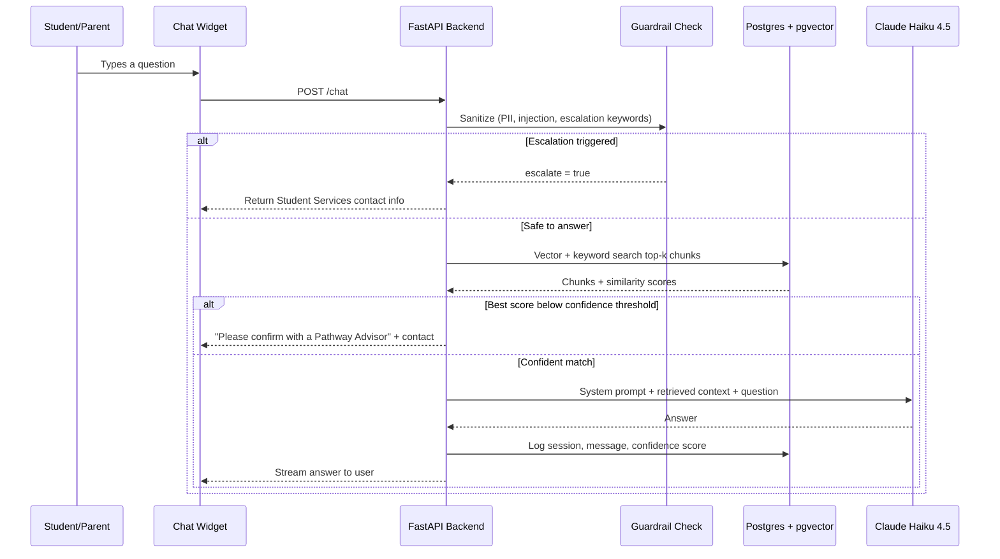

# Olinda — Hobart College AI Chatbot Technical Blueprint

**Purpose:** a simple, low-cost, reliable RAG (Retrieval-Augmented Generation) system to answer student/parent questions on TASC courses, VET, TCE, and campus services — and to hand off to Student Services when it can't safely answer.

**Design rule for every decision below:** the cheapest option that is still reliable wins. This is a single-college chatbot with modest traffic, not a product with millions of users, so we don't need enterprise-scale infrastructure.

> **Note on current state:** the live prototype (`ibnaziarafi.github.io/HoCo`) is plain HTML/CSS/JS with `msg.includes()` keyword matching, hosted free on GitHub Pages. Everything below is the **next sprint's upgrade**, once DECYP approves an actual LLM. It's designed so the front-end barely has to change — it just starts calling a real backend instead of matching keywords locally.

---

## 1. Tech Stack & Model Selection

### 1.1 LLM choice

| Model | Input / Output (per million tokens) | Context window | Why / why not |
|---|---|---|---|
| **Claude Haiku 4.5** ✅ recommended | $1 / $5 | 200K tokens | Fast, cheap, strong instruction-following, native structured/JSON output (useful for confidence scoring below), good tool-use support. Best accuracy-per-dollar for a system that must not make things up to students. |
| Gemini 2.5 Flash-Lite | $0.10 / $0.40 | 1M tokens | 10x cheaper than Haiku, but noticeably weaker reasoning — riskier for a use case where wrong course-prerequisite info matters. |
| Gemini 2.5 Flash | $0.15 / $1.25 | 1M tokens | Reasonable middle ground if Haiku turns out too expensive at scale. |

**Recommendation:** Claude Haiku 4.5 as the single model. At realistic college traffic (a few hundred students, a handful of messages each per session), monthly LLM cost will likely be **single-digit dollars**, so the 10x price gap to Flash-Lite isn't worth the accuracy risk. Don't over-optimize a cost that's already near zero.

*(If cost ever becomes a real concern, the optimisation isn't switching models — it's adding prompt caching for the system prompt, which cuts input cost ~90% for free.)*

### 1.2 Backend
**FastAPI (Python)** — lightweight, async, one file can hold the whole app, easy to deploy anywhere, huge ecosystem for PDF parsing and embeddings.

### 1.3 Frontend
Keep the **vanilla HTML/CSS/JS drawer widget** you already have. It just needs one change: instead of `msg.includes()` logic, it does a `fetch()` call to the new backend and streams the response back in. No framework needed — a React rewrite would be extra complexity for zero real benefit here.

```
Current:  User types → JS keyword match → canned reply
New:      User types → fetch('/chat') → FastAPI → RAG + LLM → streamed reply
```

---

## 2. Architecture Overview

```
┌─────────────────────────────┐
│  Existing HTML/CSS/JS Widget │  (GitHub Pages, unchanged look)
└──────────────┬───────────────┘
               │ HTTPS (fetch / SSE stream)
               ▼
┌─────────────────────────────────────────┐
│              FastAPI Backend             │
│  1. Guardrail check (PII + injection)    │
│  2. Escalation keyword check             │
│  3. Retrieval (vector + keyword search)  │
│  4. Confidence check                     │
│  5. Build prompt → call Claude Haiku 4.5 │
│  6. Log to Postgres                      │
└───────┬───────────────────────┬──────────┘
        │                       │
        ▼                       ▼
┌───────────────────┐   ┌──────────────────────┐
│ Postgres + pgvector │   │  Postgres (same DB)  │
│ (course chunks,      │   │  sessions, messages,  │
│  embeddings)         │   │  unanswered_log       │
└───────────────────┘   └──────────────────────┘
```

**Key simplification vs. a typical enterprise RAG diagram:** one Postgres database does triple duty — vector store, session logs, and analytics. That's one thing to host and back up instead of three (no separate Qdrant/Pinecone cluster to pay for or babysit).

### Mermaid version (renders automatically on GitHub)



---

## 3. Data Pipeline & RAG Setup

### 3.1 Sources to ingest
- Hobart College Course Guide (PDF)
- TASC subject prerequisite pages (PDF or web)
- Campus/services FAQ pages (web)

### 3.2 Chunking strategy
- Chunk size: ~300–500 tokens, ~50 token overlap (keeps a whole prerequisite paragraph together instead of cutting it mid-sentence)
- Metadata tags per chunk, so retrieval can filter as well as search:
  - `subject_code` (e.g. "MAT315120")
  - `tasc_level` ("2", "3", "4")
  - `career_field` ("health", "trades", "business"...)
  - `doc_type` ("course_guide", "faq", "tasc_standard")

### 3.3 Vector database — two honest options

| Option | Cost | Complexity | When to use |
|---|---|---|---|
| **pgvector on Supabase/Neon (free tier)** ✅ recommended | $0 to start | Low — same DB as your session logs | College-scale traffic; you want one thing to maintain, not two |
| Qdrant (self-hosted or free cloud tier) | $0–low | Medium — separate service, but built-in hybrid (vector + BM25) search | If you outgrow Postgres search quality later, or want fancier hybrid ranking out of the box |

Given the "minimal infrastructure, production-ready simplicity" goal, **start with pgvector**. Postgres can do "vector similarity + keyword `ILIKE`/full-text" hybrid search well enough at this scale — you don't need a dedicated vector database service for a single college's course guide.

### 3.4 Ingestion script (Python)

```python
# ingest.py — reads PDFs, chunks them, embeds locally (no API cost), stores in Postgres
import pdfplumber
import psycopg2
from sentence_transformers import SentenceTransformer

# Free, local embedding model — no per-call API cost, runs on CPU fine at this scale
embedder = SentenceTransformer("all-MiniLM-L6-v2")

def extract_text(pdf_path):
    text = ""
    with pdfplumber.open(pdf_path) as pdf:
        for page in pdf.pages:
            text += (page.extract_text() or "") + "\n"
    return text

def chunk_text(text, chunk_size=400, overlap=50):
    words = text.split()
    chunks = []
    start = 0
    while start < len(words):
        end = start + chunk_size
        chunks.append(" ".join(words[start:end]))
        start = end - overlap
    return chunks

def ingest_file(pdf_path, subject_code, tasc_level, career_field, doc_type):
    text = extract_text(pdf_path)
    chunks = chunk_text(text)
    embeddings = embedder.encode(chunks).tolist()

    conn = psycopg2.connect("dbname=olinda user=postgres")
    cur = conn.cursor()
    for chunk, embedding in zip(chunks, embeddings):
        cur.execute(
            """
            INSERT INTO course_chunks
                (content, embedding, subject_code, tasc_level, career_field, doc_type, source_file)
            VALUES (%s, %s, %s, %s, %s, %s, %s)
            """,
            (chunk, embedding, subject_code, tasc_level, career_field, doc_type, pdf_path),
        )
    conn.commit()
    cur.close()
    conn.close()

if __name__ == "__main__":
    ingest_file("course_guide_2027.pdf", None, "2", None, "course_guide")
```

---

## 4. Core API & Backend Logic

### 4.1 Escalation rule
Per your own boundary rules, some things must **never** be answered by the bot: personal student records, fee/enrolment changes, complex medical/counselling needs, custom schedule changes. These are caught by a simple keyword/pattern check **before** any retrieval happens — cheapest and safest place to stop.

### 4.2 FastAPI app (core logic)

```python
# main.py
import re
from fastapi import FastAPI
from pydantic import BaseModel
import anthropic
import psycopg2

app = FastAPI()
client = anthropic.Anthropic()  # reads ANTHROPIC_API_KEY from env

ESCALATION_PATTERNS = [
    r"\bmy (enrolment|enrollment|fees?|record)\b",
    r"\bcounsell?ing\b",
    r"\bmedical\b",
    r"\bchange my (timetable|schedule)\b",
]
PII_PATTERNS = [
    r"\b\d{9,10}\b",              # student ID-like numbers
    r"[\w.+-]+@[\w-]+\.[\w.-]+",  # email addresses
]

CONFIDENCE_THRESHOLD = 0.72  # tune after real usage data comes in

SYSTEM_PROMPT = """You are Olinda, Hobart College's course advisor assistant.
Only answer using the provided context. If the context doesn't clearly cover
the question, say so and recommend the student confirm with a Pathway Advisor
or Student Services (hobart.college@decyp.tas.gov.au, (03) 6220 3133).
Never invent subject codes, prerequisites, or dates."""

class ChatRequest(BaseModel):
    session_id: str
    message: str

def check_escalation(message: str) -> bool:
    return any(re.search(p, message, re.IGNORECASE) for p in ESCALATION_PATTERNS)

def redact_pii(message: str) -> str:
    for pattern in PII_PATTERNS:
        message = re.sub(pattern, "[redacted]", message)
    return message

def retrieve_context(message: str, conn):
    # Simplified: real version embeds the query and does a pgvector similarity query
    cur = conn.cursor()
    cur.execute(
        """
        SELECT content, 1 - (embedding <=> %s) AS score
        FROM course_chunks
        ORDER BY embedding <=> %s
        LIMIT 5
        """,
        (query_embedding, query_embedding),  # query_embedding computed from `message`
    )
    rows = cur.fetchall()
    cur.close()
    return rows

@app.post("/chat")
def chat(req: ChatRequest):
    safe_message = redact_pii(req.message)

    if check_escalation(safe_message):
        return {
            "escalated": True,
            "reply": "For this you'll need Student Services directly: "
                     "hobart.college@decyp.tas.gov.au or (03) 6220 3133.",
        }

    conn = psycopg2.connect("dbname=olinda user=postgres")
    chunks = retrieve_context(safe_message, conn)
    top_score = chunks[0][1] if chunks else 0

    if top_score < CONFIDENCE_THRESHOLD:
        log_unanswered(safe_message, top_score, conn)
        return {
            "escalated": False,
            "reply": "I'm not fully certain on this one — please confirm with "
                     "a Hobart College Pathway Advisor or Student Services.",
        }

    context = "\n\n".join(c[0] for c in chunks)
    response = client.messages.create(
        model="claude-haiku-4-5-20251001",
        max_tokens=500,
        system=SYSTEM_PROMPT,
        messages=[{"role": "user", "content": f"Context:\n{context}\n\nQuestion: {safe_message}"}],
    )
    reply = response.content[0].text
    log_message(req.session_id, safe_message, reply, top_score, conn)
    conn.close()
    return {"escalated": False, "reply": reply}
```

---

## 5. Data Schema & Analytics

```sql
-- One database, three simple jobs: vectors, sessions, and "what did we fail to answer"

CREATE EXTENSION IF NOT EXISTS vector;

CREATE TABLE course_chunks (
    chunk_id     UUID PRIMARY KEY DEFAULT gen_random_uuid(),
    content      TEXT NOT NULL,
    embedding    VECTOR(384),        -- matches all-MiniLM-L6-v2 output size
    subject_code TEXT,
    tasc_level   TEXT,
    career_field TEXT,
    doc_type     TEXT,
    source_file  TEXT
);

CREATE TABLE sessions (
    session_id  UUID PRIMARY KEY DEFAULT gen_random_uuid(),
    started_at  TIMESTAMPTZ DEFAULT now(),
    user_type   TEXT CHECK (user_type IN ('student','parent','prospective','unknown'))
);

CREATE TABLE messages (
    message_id        UUID PRIMARY KEY DEFAULT gen_random_uuid(),
    session_id        UUID REFERENCES sessions(session_id),
    user_message      TEXT,
    bot_reply         TEXT,
    confidence_score  FLOAT,
    escalated         BOOLEAN DEFAULT FALSE,
    created_at        TIMESTAMPTZ DEFAULT now()
);

-- The staff-facing goldmine: every question the bot wasn't confident about
CREATE TABLE unanswered_log (
    id                UUID PRIMARY KEY DEFAULT gen_random_uuid(),
    question          TEXT,
    confidence_score  FLOAT,
    occurred_at       TIMESTAMPTZ DEFAULT now(),
    reviewed          BOOLEAN DEFAULT FALSE
);
```

**How staff use this:** a weekly query grouping `unanswered_log` by similar phrasing (even a simple `GROUP BY LEFT(question, 30)` to start, or clustering later) shows the top questions the bot couldn't handle confidently — a ready-made list of what to add to the course guide or FAQ next. This is the single most useful piece of the whole system for reducing staff workload long-term.

---

## 6. Security & Safety Controls

- **PII filtering:** regex-redact anything that looks like a student ID, phone number, or email *before* it's sent to the LLM or logged — never store raw PII in `messages`.
- **Prompt injection protection:** retrieved document content is always inserted as *data*, never as instructions — the system prompt explicitly tells the model to ignore any instructions found inside the context. Basic input sanitisation strips HTML/script tags before anything reaches the model.
- **Hallucination suppression:** the model is only allowed to answer from retrieved context (see system prompt above), and the confidence threshold means low-relevance matches get a "please confirm with a Pathway Advisor" fallback instead of a guess — matching the "No Hallucinations" rule you already defined.
- **Escalation-first:** personal record / fee / medical / counselling requests never reach the LLM at all — they're caught and redirected immediately.
- **Worth confirming with DECYP before launch:** data residency (whether logs/embeddings need to stay on Australian-hosted infrastructure) and how long chat logs can be retained. Government education departments often have specific rules here — best to check with your Hobart College contacts (Simone/Lou) rather than assume.

---

## 7. Deployment Recommendations

| Piece | Recommended host | Cost |
|---|---|---|
| Frontend widget | GitHub Pages (unchanged) | Free |
| FastAPI backend | Render or Railway (hobby tier) | Free–$7/month |
| Postgres + pgvector | Supabase or Neon (free tier includes pgvector) | Free at this scale |
| LLM calls | Anthropic API (Claude Haiku 4.5) | Likely a few $ / month |

**Total estimated running cost for a pilot: $0–15/month.** This can run for the whole trial sprint on free tiers alone, with a small buffer once DECYP approval comes through and real traffic starts.

---

## 8. Summary — what changes from your current build

- Frontend: same file, same look, just swap the keyword-matching function for a `fetch('/chat')` call.
- New: FastAPI backend, one Postgres database (pgvector + logs), Claude Haiku 4.5 for generation.
- New: an escalation layer that catches the "don't answer this" cases your project already defined, before they ever reach the model.
- New: an `unanswered_log` table that gives the team (and Student Services) a running list of what the FAQ is missing — this is the actual admin-load reducer over time, not just the chatbot itself.
